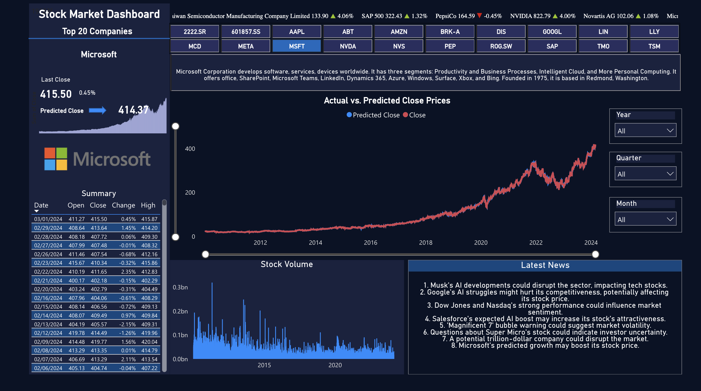

# Stock Report on Top 20 Stocks – FabricAIHack

[View the full interactive report](https://app.powerbi.com/view?r=eyJrIjoiOTQ5ZjcwNzgtYzVkZS00NmRhLWIxZWUtZjIzMWYxNWZkNzk5IiwidCI6IjdlYzIwMTdjLWYzOWYtNGQwOC05YmY1LThmNjYzNDM2YmJkYiIsImMiOjZ9)
## Project Overview

This project involves the creation of a Power BI report on the top 20 stocks, using Microsoft Fabric (Fabric Notebooks, Lakehouse, SQL Analytics Endpoint, Data Pipelines)  and OpenAI API for summarizing company descriptions and the latest news. Employed a RandomForestRegressor model from the sklearn library to predict the closing price of these stocks. This project provides near real-time insights into stock prices, company descriptions, and the latest financial news.


## Project Structure

The project is organized into a dedicated workspace(FinanceAI), and then created a lakehouse (FinanceLakehouse). Within the lakehouse, three Fabric notebooks are utilized for distinct purposes:

- [Prediction Model Notebook](https://github.com/AkhilGurrapu/FabricAIHack-StockReport/blob/main/Notebooks/Prediction%20Model%20Notebook.ipynb): Fetches stock data and employs a RandomForestRegressor model for predicting the closing prices of stocks and then writing the data into lakehouse after transformations.

- [Company Summary Notebook](https://github.com/AkhilGurrapu/FabricAIHack-StockReport/blob/main/Notebooks/CompanySummaryNotebook.ipynb): Summarizes company descriptions using OpenAI API which is retrieved through the yfinance library and then writing the data into lakehouse.

- [News Summary Notebook](https://github.com/AkhilGurrapu/FabricAIHack-StockReport/blob/main/Notebooks/NewsSummaryNotebook.ipynb): Summarizes Latest Financial news using OpenAI API which is retrieved through the yfinance library and then writing the data into lakehouse.


## Pipeline and Scheduling:

To ensure the analysis reflects the most current data, all notebooks within the 'FinanceLakehouse' are scheduled to run every 5 minutes. This automated pipeline allows for near real-time analysis, providing up-to-date insights into stock performance, news, and company overviews.


## Technologies Used

- **Microsoft Fabric (Fabric Notebooks, Lakehouse, SQL Analytics Endpoint, Data Pipelines)**: Utilized for seamless integration and management within the Microsoft ecosystem.
- **OpenAI API**: Powers the summarization of company descriptions and news articles.
- **yfinance**: A Python library used for fetching real-time market data from Yahoo Finance.
- **RandomForestRegressor & sklearn**: Machine learning tools used for predicting stock prices based on historical data.
- **Power BI**: For creating interactive reports and visualizations.

## Getting Started
### Prerequisites:

- [Free Microsoft Fabric account](https://www.microsoft.com/en-us/microsoft-fabric/getting-started)
- OpenAI API key

### Setup:

1. **Create a Dedicated Workspace**:

    Start by creating a dedicated workspace named FinanceAI in Microsoft Fabric.

2. **Create a Lakehouse**:

    Within the FinanceAI workspace, create a lakehouse named FinanceLakehouse.


4. **Run the Notebooks**:

    Download the provided notebooks and run them within your FinanceLakehouse.
    [Download Notebooks](https://github.com/AkhilGurrapu/FabricAIHack-StockReport/tree/main/Notebooks)

    The execution of these notebooks will create three different tables within your lakehouse. These tables will be used to generate a Power BI report.

5. **SQL Analytics Endpoint**:

    Switch to the SQL analytics endpoint within your lakehouse.
    
    Create a view for the tickers table with the following SQL query:
    
    ```sql
    SELECT [Ticker]
    FROM [FinanceLakehouse].[dbo].[CompanySummary] AS [$Table]
    ```
    or you can use Visual Query to create a view as shown in the video below.
    
    This view will act as a connecting table to all other tables.

6. **Model View**:

    Add the three tables and the newly created view to the default model view by switching to the model view in your SQL Analytics Endpoint.
   


8. **Generate the Report:**

    Click on "New Report" to start creating your StocksReport using the data available in your model view.

## Features
- **Stock Price Prediction**: Leverages RandomForestRegressor and sklearn for accurate predictions of stock closing prices.
- **Company Description Summarization**: Utilizes OpenAI's API to provide concise summaries of company backgrounds.
- **Latest News Summarization**: Keeps you updated with the latest news related to the stocks in focus, using OpenAI's API for summarization.

# Video Demonstration:


[](https://www.youtube.com/watch?v=0XzvB8J2AcM "Watch the video")


